autoscale: false
slidenumbers: true, text-align(center)
footer: 
text: #FFFFFF
background-color: #004712
header: text-scale(1.0), line-height(0.9), #FFFFFF
list: bullet-character(•)

<!--
AI and Emerging Technologies Presentation
Pine Crest School
Innovation Institute 2019
For use with DeckSet 2.0
-->

# [fit] AI and Emerging Technologies
# [fit] in the Middle School
## Sean Tibor and Pedro Uribe

[.background-color: #000000]

---

# **Sean Tibor**

- 6th & 8th Grade Computer Science Teacher
- 1st Year Teaching
- Transfer from IT and Digital Marketing Career
- Co-host of [Teaching Python](https://www.teachingpython.fm)

[@smtibor](https://twitter.com/smtibor) on Twitter

---

# **Pedro Uribe**

- Computer Science and Technology Specialist
- Boca Raton Campus
- Code.org Facilitator
- Not the FBI's Most Wanted Pedro Uribe from Unsolved Mysteries, Season 2, Episode 18

---

# [fit] History of AI

^Albert Samuel plays checkers against an IBM 701

^AI is not a new idea. The first AI research happened back in the early 20th century with neural networks

^Recent advances in computing power and neural network designs have lead to an explosion of interest in machine learning and deep learning

[.background-color: #000000]

---

# [fit] Artificial Intelligence?
# [fit] Machine Learning?
# [fit] Deep Learning?

---

# Subsets of Artificial Intelligence

[.hide-footer]
[.background-color: #FFFFFF]
[.slidenumber-style: #004712, alignment(right)]
[.header: #004712]

---

# [fit] **Artificial Intelligence**
## [fit] Computers perform tasks in ways that resemble humans

^ Talos, the ancient greek automaton that circled the isle of Crete to protect it from pirates and invaders

[.background-color: #000000]

---

# [fit] **Machine Learning**
## [fit] Computers improve their performance based on data results

[.background-color: #000000]

---

# [fit] **Deep Learning**
## [fit] Computers adapt to new data and learn from experience

---

# [fit] AI Family Tree

---

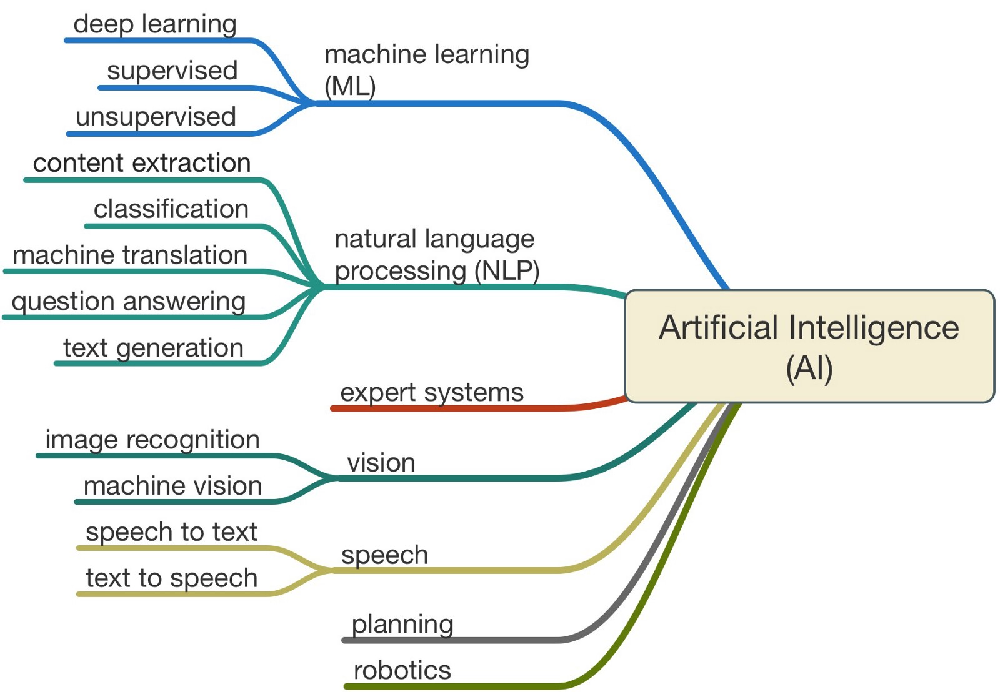

[.background-color: #FFFFFF]
[.slidenumber-style: #004712, alignment(right)]

---

# [fit] MarI/O

---

---

# [fit] The World
### (+5 Years)

[.background-color: #000000]

---

# More AI

* Self Driving Cars
* Predictive Analytics
* Deep Learning
* Computer Vision

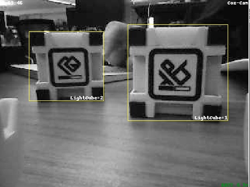

^ Will today's kindergarten students learn to drive in 2030?

^ How will our students compete with AI job candidates?

^ Will there be any profession without AI enhancement tools?

---

# AI Compute Increased 300,000x in Six Years

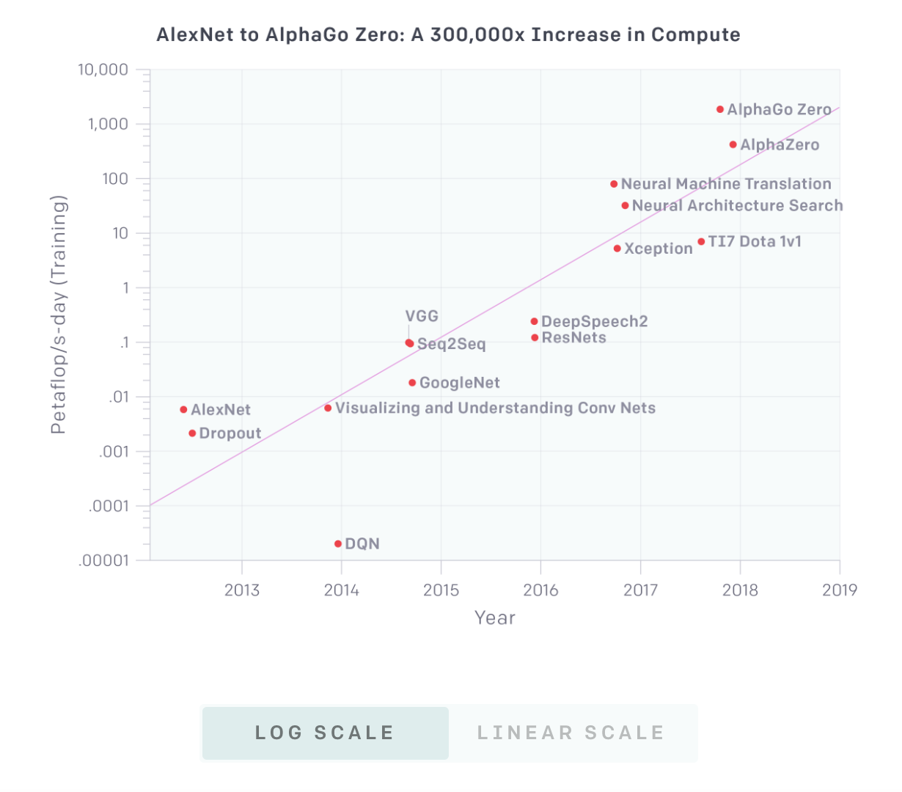

[.hide-footer]

---

# More Robotics

- Manufacturing
- Healthcare
- Consumer

52% of adult internet users believe that robots will perform most human activites in 30 years. ([Brookings Institute](https://www.brookings.edu/blog/techtank/2018/06/21/brookings-survey-finds-52-percent-believe-robots-will-perform-most-human-activities-in-30-years/))

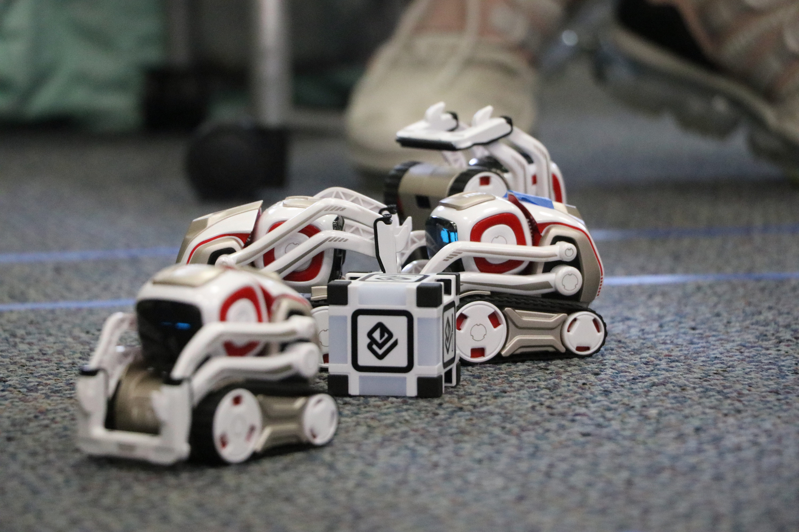

^Boston Dynamics recently showed warehouse robots that could efficiently reach, stack, and organize boxes weighing up to 33 pounds.

^Teleoperated robotic surgery combines VR/AR displays with remotely operated surgery tools

---

# Cheaper, Better VR

- [Oculus Rift S](https://www.oculus.com/rift-s/?local=en_US)
- [Oculus Quest](https://www.oculus.com/quest/?locale=en_US)
- [HTC Focus](https://enterprise.vive.com/ca/focus-plus/)

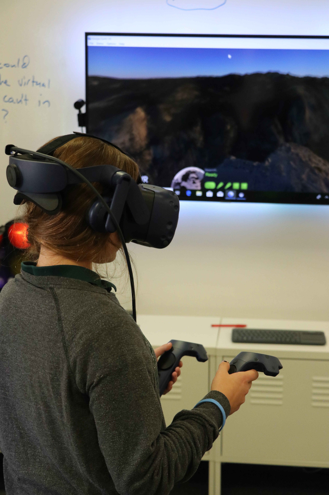

^New VR hardware is cheaper, more capable, more comfortable, and wireless.

^Pine Crest uses VR to explore the human body with The Body VR and the world with Google Earth

---

# More Capable AR

- [Apple ARKit 2](https://www.apple.com/ios/augmented-reality/)
- [Magic Leap](https://www.magicleap.com/magic-leap-one)
- [Microsoft HoloLens](https://www.microsoft.com/en-us/hololens/buy)

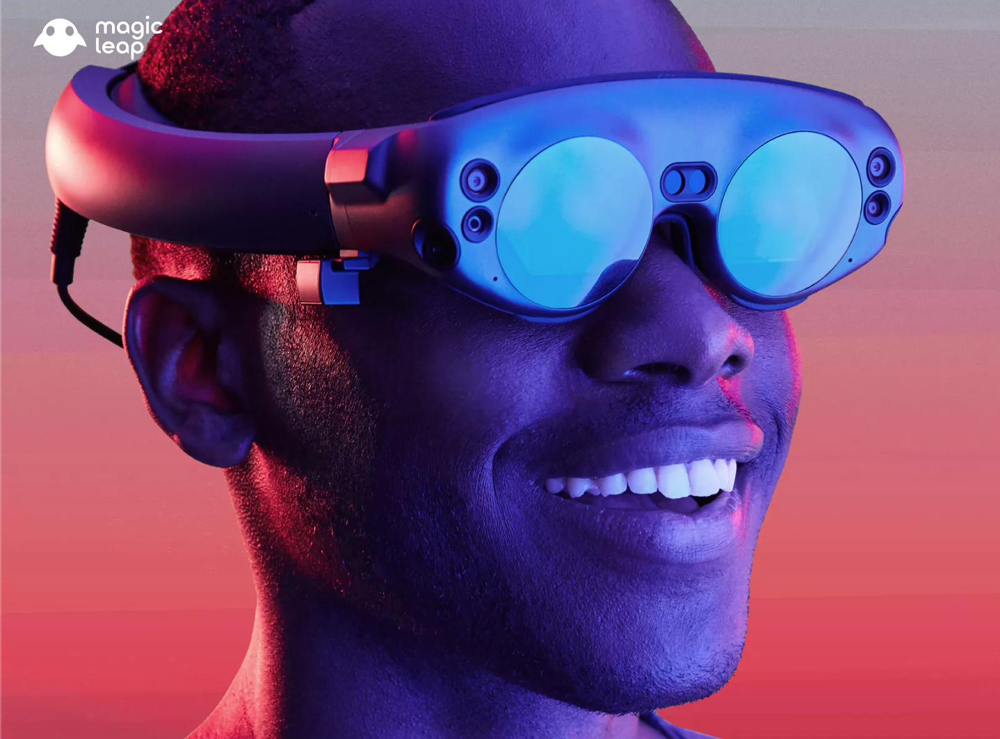

---

# [fit] Teaching AI

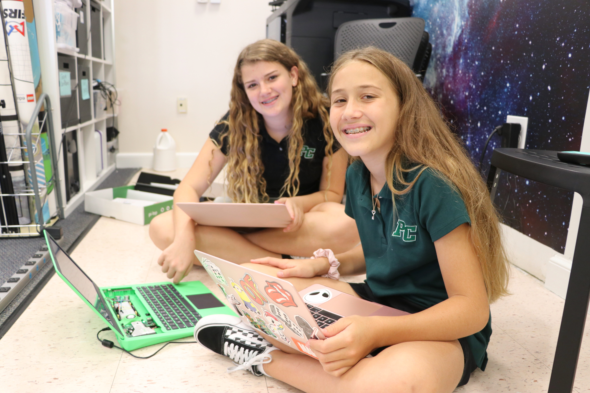

---

# Middle School Considerations

1. Students are developing rapidly
2. Cognitive capabilities are sufficient for advanced topics
3. Foundational knowledge may not be established

---

# [fit] Our Approach

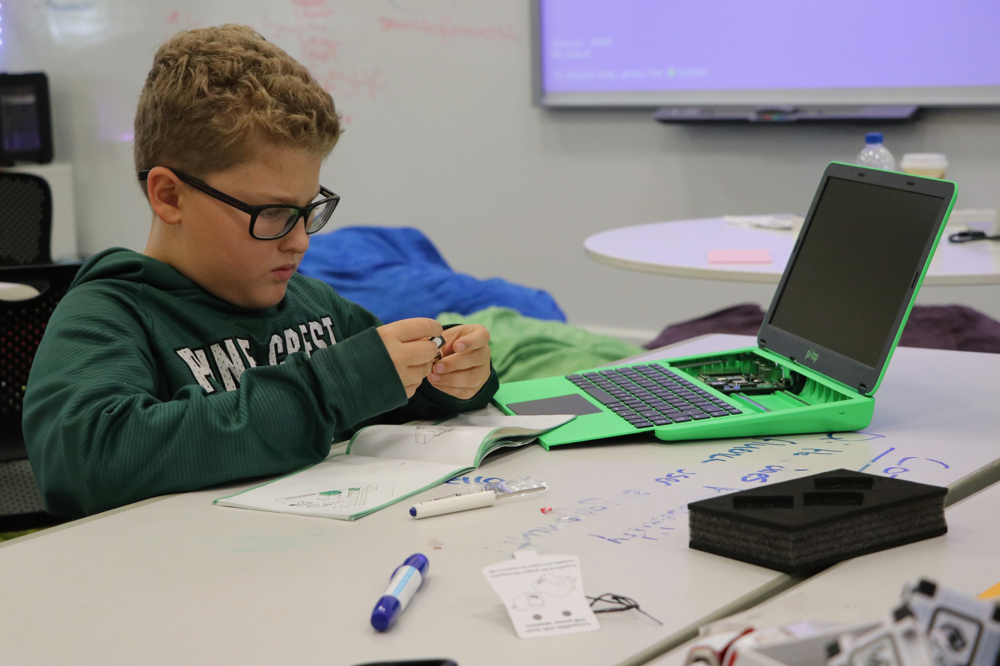

---

## Web-based Examples

- Quick Draw
- Google CoLab
- Google Image Classification
- TensorFlow Playground

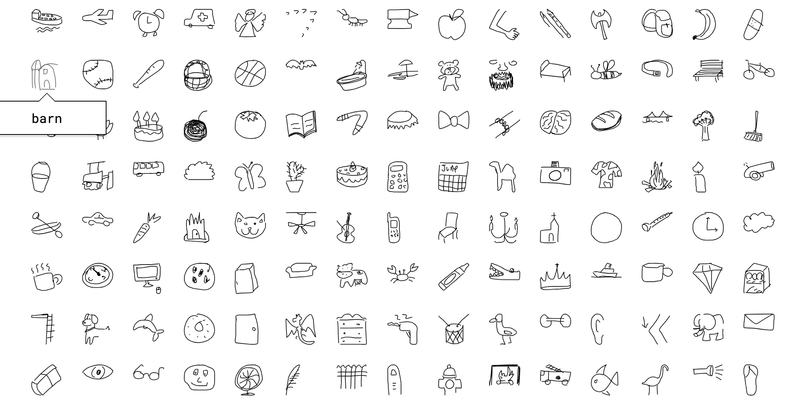

---

# Activities

- Train Google Quick Draw and race the clock
- Smallest Viable [Tensor Network](https://playground.tensorflow.org)
- Make [GAN Art](http://gandissect.res.ibm.com/ganpaint.html?project=churchoutdoor&layer=layer4)
- Write a [Chat Bot](https://medium.com/analytics-vidhya/building-a-simple-chatbot-in-python-using-nltk-7c8c8215ac6e)
- Create an [Alexa Skill](https://developer.amazon.com/alexa-skills-kit/guides)

^ You can download the quick draw dataset

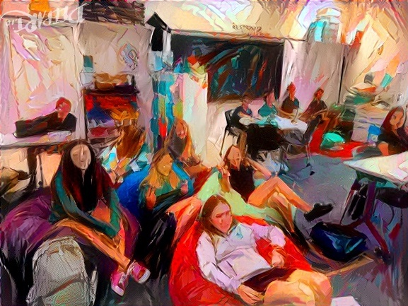

---

## Gaming

Middle school students love games.

- Play 20 Questions vs. AI
- DIY Blackjack Opponent
- Make AI that plays Gun, Gun, Shoot

[.background-color: #000000]

---

## AI Robots

- Vector by Anki (Recommended)
- Cozmo by Anki (Recommended)
- Cue by Wonder Workshop

^ Look for robots that can leverage computer vision, perception, or machine learning/deep learning

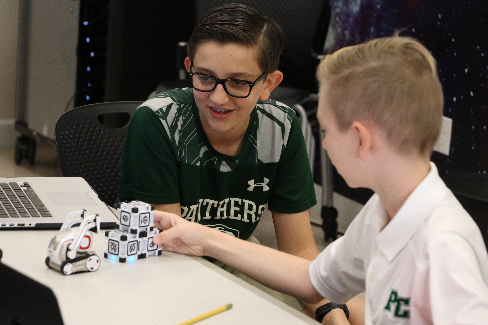

[.background-color: #000000]

---

# Resources

- [Google Quick Draw](https://quickdraw.withgoogle.com/)
- [Tensor Playground](https://playground.tensorflow.org)
- [Google CoLab AI Notebook](https://colab.research.google.com/drive/1uL7_woGrK7GviAlJkvB5IPu8P2Dwo2_L)
- [Image Kernels Explained Visually](http://setosa.io/ev/image-kernels/)
- [GAN Paint](http://gandissect.res.ibm.com/ganpaint.html?project=churchoutdoor&layer=layer4)
- [Cool Applications of GAN](https://medium.com/@jonathan_hui/gan-some-cool-applications-of-gans-4c9ecca35900_)

[.background-color: #000000]

---

## Q&A

---

# Other Resources

---

## Middle School Robots

- Cozmo
- Vector
- Cue

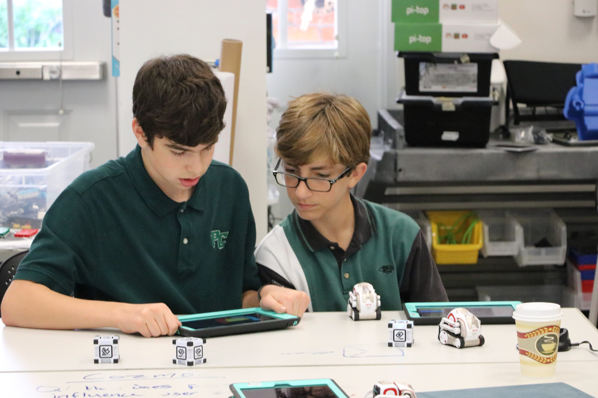

--- 

## Virtual Reality Tools

- HTC Vive Pro
- Oculus Rift
- Google Expeditions

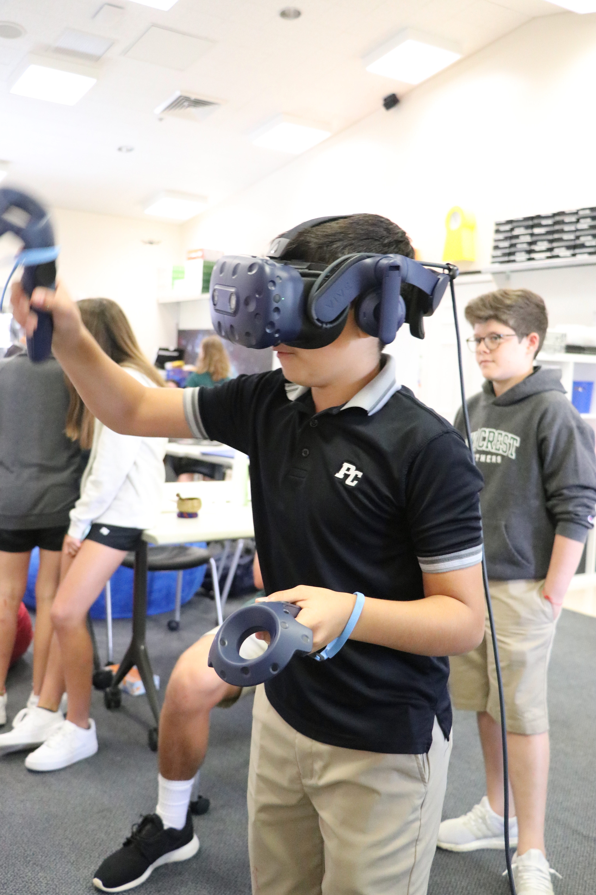

---

## Thank You