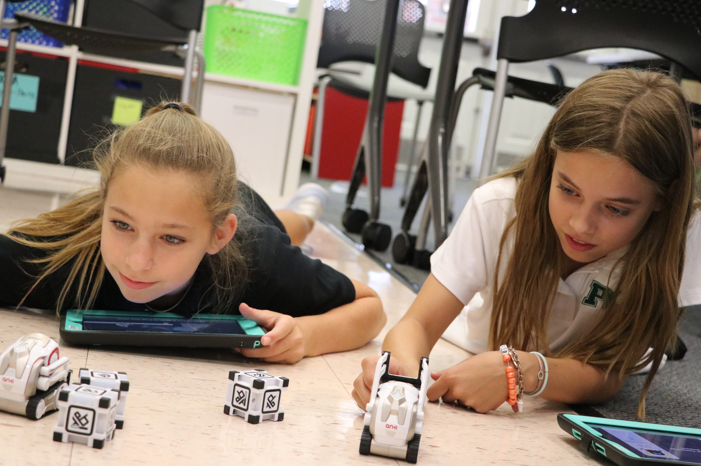
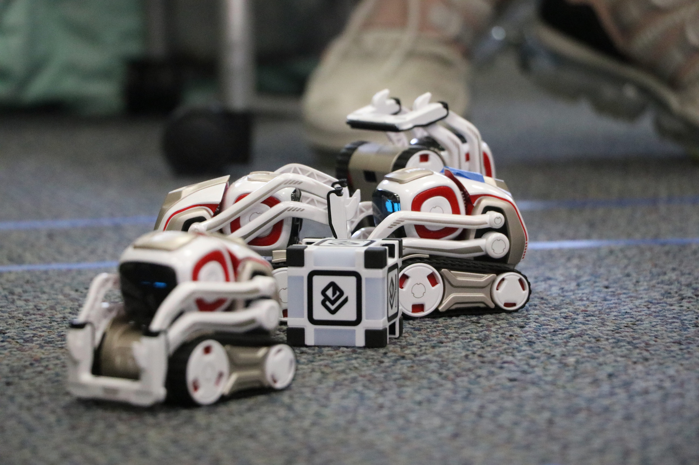
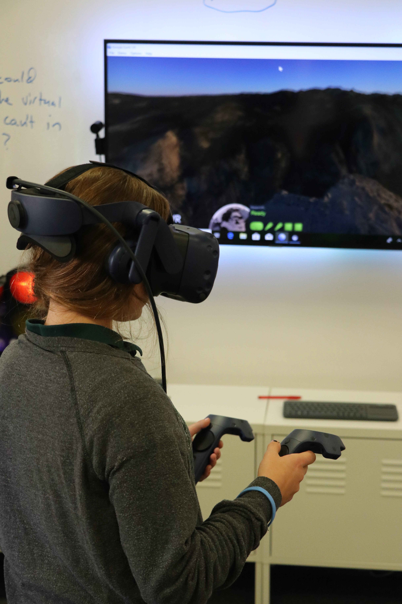

autoscale: false
slidenumbers: true
footer: 

## AI and Emerging Technologies in the Middle School
### Sean Tibor and Pedro Uribe

[.background-color: #000000]

---

# Sean Tibor

* 6th & 8th Grade Computer Science Teacher
* 1st Year Teaching
* Transfer from IT and Digital Marketing Career
* Co-host of [Teaching Python Podcast](https://www.teachingpython.fm)

[@smtibor](https://twitter.com/smtibor)

---

# Pedro Uribe

---

# History of AI

---

# [fit] The World in +5 Years

[.background-color: #000000]

---

# More AI

* Self Driving Cars
* Predictive Analytics
* Deep Learning
* Computer Vision

---

# More Robotics

* Manufacturing
* Healthcare
* Consumer

---

# Cheaper, Better VR

* [Oculus Quest](https://www.oculus.com/quest/?locale=en_US)
* [HTC Focus](https://enterprise.vive.com/ca/focus-plus/)
* [Oculus Go](https://www.oculus.com/go/?local=en_US)

# More Capable AR

* [Apple ARKit 2](https://www.apple.com/ios/augmented-reality/)
* [Magic Leap](https://www.magicleap.com/magic-leap-one)
* [Microsoft HoloLens](https://www.microsoft.com/en-us/hololens/buy)

---

# Middle School Considerations

1. Students are developing rapidly
2. Cognitive capabilities are sufficient for advanced topics
3. Foundational knowledge may not be established

---

# Teaching AI

---

# Resources

---

# Activities
## Gaming

---

# Cross-Disciplinary AI Collaboration

---

## Virtual Reality Tools

* HTC Vive Pro
* Oculus Rift
* Google Expeditions
* 

---

## Robotics

---

# Middle School Robots

* Cozmo
* Vector
* Cue

## Q&A

---

## Thank You