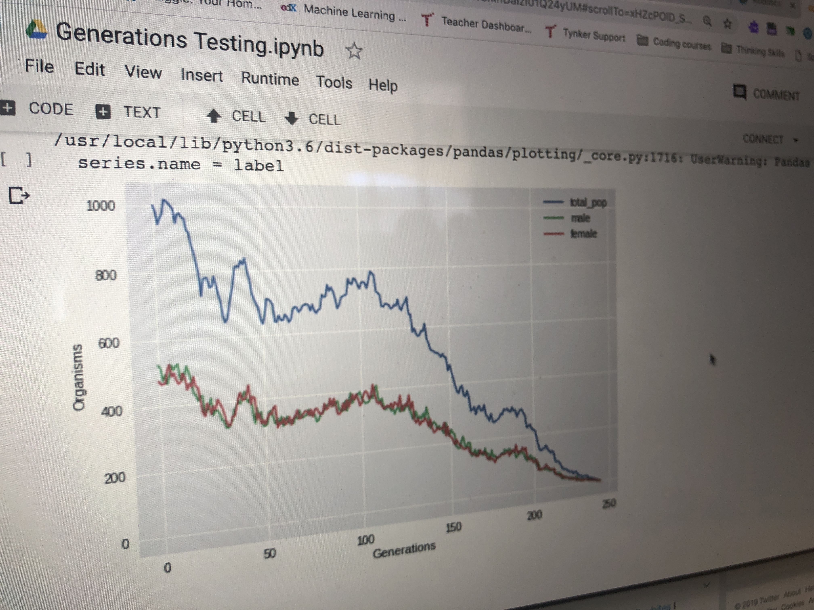

autoscale: true
slidenumbers: true
footer: 

# AI and Emerging Technologies
## Sean Tibor and Pedro Uribe

[.background-color: #000000]

---

# Sean Tibor

* 6th & 8th Grade Computer Science Teacher
* 1st Year Teaching
* Transfer from IT and Digital Marketing Career
* Host of Teaching Python Podcast

---

# Pedro Uribe

---

# [fit] The World in +5 Years

[.background-color: #000000]

---

# More AI

* Self Driving Cars
* Predictive Analytics
* Deep Learning
* Computer Vision

---

# More Robotics
* Manufacturing
* Healthcare

---

## Artificial Intelligence Explosions

---

## AR & VR

---

## Robotics

---

## Q&A

---

## Thank You