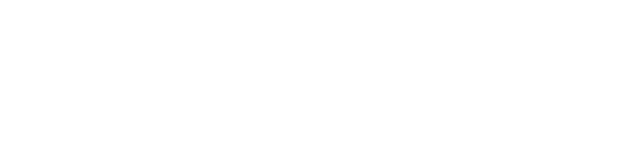

autoscale: true
slidenumbers: true
footer: 

# AI and Emerging Technologies
## Sean Tibor and Pedro Uribe
### Pine Crest Innovation Institute 2019

---

## Who We Are

### Sean Tibor
* 6th & 8th Grade Computer Science Teacher
* 1st Year Teaching
* Transfer from IT and Digital Marketing Career
* Host of Teaching Python Podcast

### Pedro Uribe

---

## [fit] The World in +5 Years

---

### More AI
* Self Driving Cars
* Predictive Analytics
* Deep Learning
* Computer Vision

---

### More Robotics
* Manufacturing
* Healthcare

---

## Artificial Intelligence Explosions

---

## AR & VR

---

## Robotics

---

## Q&A

---

## Thank You