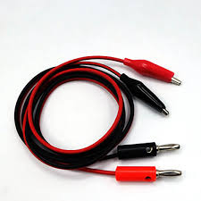
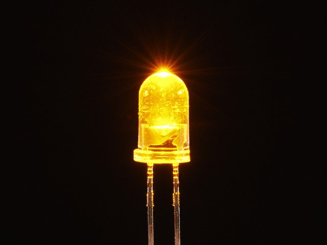
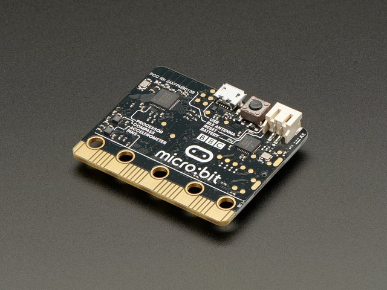

autoscale: false
slidenumbers: true
footer: <br>[Python Cheat Sheet - http://bit.ly/ParedesPython](http://bit.ly/ParedesPython)
text: #FFFFFF
background-color: #004712
header: text-scale(1.0), line-height(0.9), #FFFFFF, alignment(left)
list: bullet-character(•), line-height(0.6)


<!--
Hour of Python Presentation
Pine Crest School
Innovation Institute 2019
For use with DeckSet 2.0
-->

# [fit] Hour of Python
## Kelly Schuster-Paredes ([@KellyPared](https://twitter.com/KellyPared))
## Sean Tibor ([@smtibor](https://twitter.com/smtibor))


[.background-color: #000000]

---

# **Kelly Schuster-Paredes**
### Fort Lauderdale Middle School 
### Computer Science and Education Technology Specialist

[@KellyPared](https://twitter.com/KellyPared) on Twitter

```python
kelly_fun_facts = {'origin': 'Sebastian, Florida',
                  'countries_taught_in': ['Peru', 'USA', 'UK']}
```


[.header: alignment(left)]

---

# **Sean Tibor**
### Fort Lauderdale Middle School 
### Computer Science and Education Technology Specialist

[@smtibor](https://twitter.com/smtibor) on Twitter

```python
sean_fun_facts = {'origin': 'Anchorage, Alaska',
                  'can_sew': True}
```


[.header: alignment(left)]

---

Co-hosts of the [*Teaching Python*](https://www.teachingpython.fm) podcast
(for good-looking and talented people like you)

```python
while shameless_plug:
    audience.listen_to(podcast='www.teachingpython.fm')
```


---

# [fit] Only 1 Hour for Python?
## Let's get to it!

[.header: alignment(center)]

---

# [fit] What is Python?

^ Fastest growing programming language
^ "Full Spectrum" Language
^ Emphasizes readability


--- 

# Student Python Projects

- Pi-Tops
- Smartphone Drop Sensors
- Interactive Fiction
- Embroidery
- Web Browser Automation
- NeoPixels


---

# Today's Development Environments

- Repl.it (www.repl.it)
- Mu Editor (codewith.mu)
- Thonny (thonny.org)
- IDLE (Python.org)

(Or use your own)

^ If you don't have Mu or Thonny installed, just go with Repl.it

---

# Hello World

```python
print('Hello World')
```

---

# Beginner Challenges

- Draw a square using Turtle
- Find the sum of all even numbers from 2 to 143,568 (inclusive)
- Connect to a Micro:bit and light up the display

---

# Intermediate Challenges
- Create a function that creates n-pointed stars using [Turtle](https://docs.python.org/3.7/library/turtle.html?highlight=turtle)
- Use [Requests](http://docs.python-requests.org/en/master/) to get the current temperature and humidity for Boca Raton
- Plot accelerometer data from the microbit using [Mu](https://codewith.mu)

---

# How to Flash an External LED on a Microbit
## By Olivia M.

---

First, gather the materials. You will need:

- banana clip to alligator clip wire (x2)
- external LED
- Microbit
- Micro USB cord






[.background-color: #000000]

---

# Instructions

---

## Code:
First, open Mu Editor and start a new code.  Then, type this code:

```python
from microbit import *

while True:
    pin0.write_digital(1)
    sleep(500)
    pin0.write_digital(0)
    sleep(500)
```

---

Line 1: importing microbit library into the code
Line 3: starting a forever loop (making the code under run forever)
Line 4: pin0 (0 hole on microbit) blinking for 1 second
Line 5/7: stopping pin0 for 500 milliseconds
Line 6: turning pin0 off (allowing it to blink)

---

## Building the Microbit Part:

1. Plug in micro USB cord into the USB in your computer
1. Plug the Micro USB end into the Microbit
1. Plug the banana clip ends of the alligator to banana clip cords into the 0 and GND holes in the microbit
1. Attach the alligator ends of the alligator to banana clip cords to the 2 metal ends of the external LED (one alligator clip on each wire end) 
1. Run the code (make sure Mu is on Microbit mode)

---

## Congratulations, you have now made a flashing external light using a Microbit and Python 3!

---

## If you need more help:
- [https://www.youtube.com/watch?v=0P7P4DpVlZw](https://www.youtube.com/watch?v=0P7P4DpVlZw)

- [https://learn.adafruit.com/micro-bit-lesson-2-controlling-leds-on-breadboard?view=all](https://learn.adafruit.com/micro-bit-lesson-2-controlling-leds-on-breadboard?view=all)


---

# [fit] Get Going!

---

# Next Steps

- #100DaysOfCode Challenge (Get better at Python and problem solving)
- Follow us on Twitter
- Try some Google Colab!
- Listen to our Podcast ([teachingpython.fm](https://www.teachingpython.fm))

---

# Clone our [GitHub Repository](https://github.com/seantibor/InnovationInstitute2019)

[https://github.com/seantibor/InnovationInstitute2019](https://github.com/seantibor/InnovationInstitute2019)

---

# Thank You