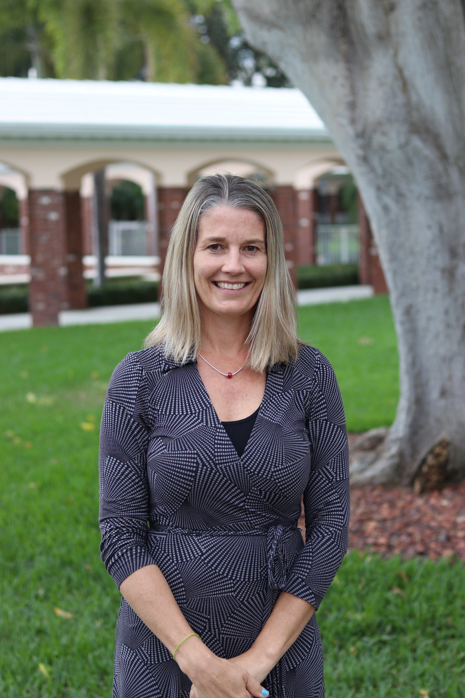
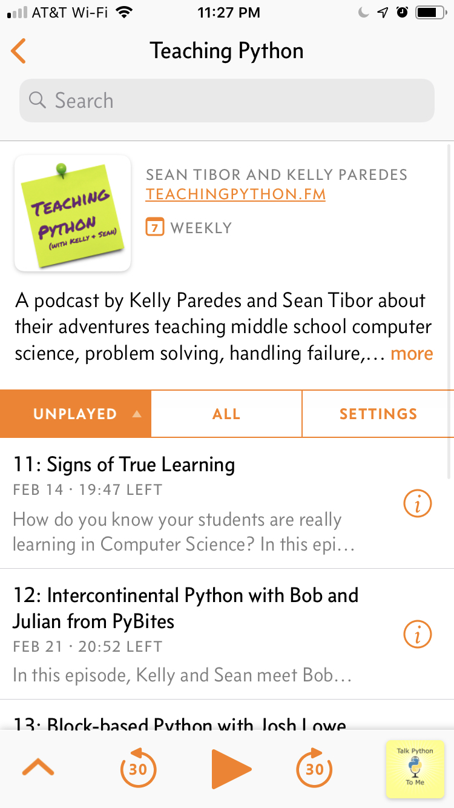

autoscale: false
slidenumbers: true
footer: 
text: #FFFFFF
background-color: #004712
header: text-scale(1.0), line-height(0.9), #FFFFFF
list: bullet-character(•), line-height(0.6)


<!--
Hour of Python Presentation
Pine Crest School
Innovation Institute 2019
For use with DeckSet 2.0
-->

# [fit] Hour of Python
## Kelly Schuster-Paredes ([@KellyPared](https://twitter.com/KellyPared))
## Sean Tibor ([@smtibor](https://twitter.com/smtibor))


[.background-color: #000000]

---

# Kelly Schuster-Paredes
[@KellyPared](https://twitter.com/KellyPared) on Twitter

Fun fact: Grew up in Sebastian, Florida, taught in Peru.



---

# Sean Tibor
[@smtibor](https://twitter.com/smtibor) on Twitter

Fun fact: From Anchorage, Alaska, can sew.


---

```python
while shameless_plug:
    audience.listen_to({'podcast': 'www.teachingpython.fm'})
```

Co-hosts of the [*Teaching Python*](https://www.teachingpython.fm) podcast
(for good-looking and talented people like you)



---

# 1 Hour for Python?
## Let's get to it!

---

# What is Python?

^ Fastest growing programming language
^ "Full Spectrum" Language
^ Emphasizes readability

--- 

# Student Python Projects

- Pi-Tops
- Smartphone Drop Sensors
- Interactive Fiction
- Embroidery
- Web Browser Automation
- NeoPixels


---