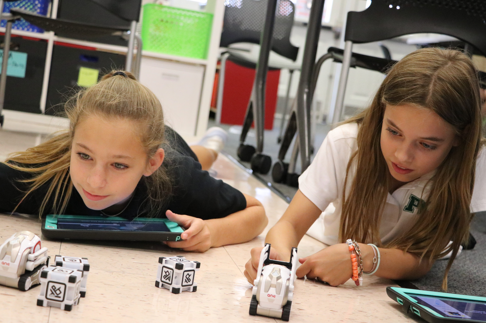

autoscale: false
slidenumbers: true
footer: 
text: #FFFFFF
background-color: #004712
header: text-scale(1.0), line-height(0.9), #FFFFFF, alignment(left)
list: bullet-character(•), line-height(0.6)


<!--
Hour of Python Presentation
Pine Crest School
Innovation Institute 2019
For use with DeckSet 2.0
-->

# [fit] Hour of Python
## Kelly Schuster-Paredes ([@KellyPared](https://twitter.com/KellyPared))
## Sean Tibor ([@smtibor](https://twitter.com/smtibor))


[.background-color: #000000]

---

# **Kelly Schuster-Paredes**
### Fort Lauderdale Middle School 
### Computer Science and Education Technology Specialist

[@KellyPared](https://twitter.com/KellyPared) on Twitter

```python
kelly_fun_facts = {'origin': 'Sebastian, Florida',
                  'countries_taught_in': ['Peru', 'USA']}
```


[.header: alignment(left)]

---

# **Sean Tibor**
### Fort Lauderdale Middle School 
### Computer Science and Education Technology Specialist

[@smtibor](https://twitter.com/smtibor) on Twitter

```python
sean_fun_facts = {'origin': 'Anchorage, Alaska',
                  'can_sew': True}
```


[.header: alignment(left)]

---

Co-hosts of the [*Teaching Python*](https://www.teachingpython.fm) podcast
(for good-looking and talented people like you)

```python
while shameless_plug:
    audience.listen_to({'podcast': 'www.teachingpython.fm'})
```


---

# [fit] 1 Hour for Python?
## Let's get to it!

---

# [fit] What is Python?

^ Fastest growing programming language
^ "Full Spectrum" Language
^ Emphasizes readability



--- 

# Student Python Projects

- Pi-Tops
- Smartphone Drop Sensors
- Interactive Fiction
- Embroidery
- Web Browser Automation
- NeoPixels


---

# Today's Development Environments

- Repl.it (www.repl.it)
- Mu Editor (codewith.mu)
- Thonny (thonny.org)
- IDLE (Python.org)

---
# Or use your own

## Your choice
    - VS Code
    - PyCharm
    - Sublime Editor
    - Atom
    - Vi/Vim???

---

# Hello World

```python
print('Hello World')
```